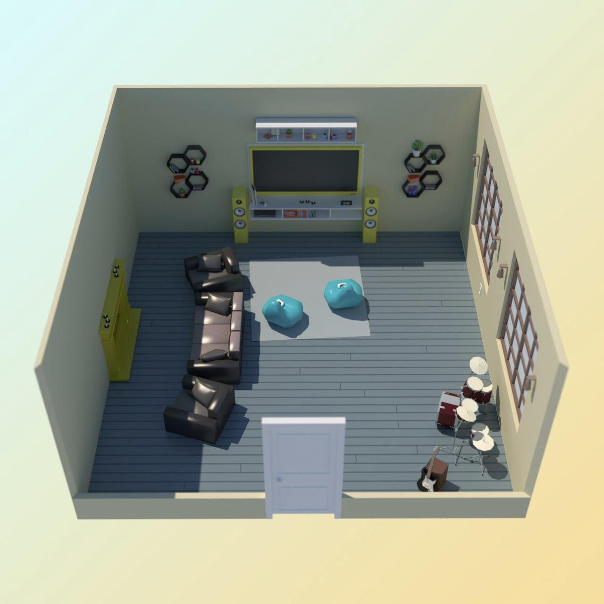

# task
Кевин Калкин, [20.12.2021 12:03]
Кажется, я в самой интересной комнате в доме

Кевин Калкин, [20.12.2021 12:03]
Сейчас отправлю фотку

Кевин Калкин, [20.12.2021 12:03]

Кевин Калкин, [20.12.2021 12:03]
так, смотрим на план помещения

Кевин Калкин, [20.12.2021 12:26]
Слушай, да, все работает, и все через умный дом

Кевин Калкин, [20.12.2021 12:26]
Проблема в том, что это последний этаж дома и мне некуда больше бежать 😨

Кевин Калкин, [20.12.2021 12:26]
Эх, если бы в моем доме была потайная лестница

Кевин Калкин, [20.12.2021 12:26]
В окне справа мой домик на дереве, он чуть пониже дома. Давай зиплайн построим?

Кевин Калкин, [20.12.2021 12:26]
Я нашел кусок дерева. Из него можно вырезать основную деталь для зиплайна. Надо рассчитать, как вырезать прямоугольник максимально возможной площади.

Кевин Калкин, [20.12.2021 12:26]
Я нашел кусок дерева. Из него можно вырезать основную деталь для зиплайна. Надо рассчитать, как вырезать прямоугольник максимально возможной площади.

Кевин Калкин, [20.12.2021 12:26]
Имеющийся кусок дерева состоит из N склеенных по боковым сторонам прямоугольников одинаковой ширины, но разной длины (длина i-го куска равна h_i)

Кевин Калкин, [20.12.2021 12:26]
Имеющийся кусок дерева состоит из N склеенных по боковым сторонам прямоугольников одинаковой ширины, но разной длины (длина i-го куска равна h_i)

Кевин Калкин, [20.12.2021 12:26]
Всего 1000 кусков, дальше в файле длина каждого куска. Можешь мне написать, какой площади у меня получится деталь?

Кевин Калкин, [20.12.2021 12:26]
Всего 1000 кусков, дальше в файле длина каждого куска. Можешь мне написать, какой площади у меня получится деталь?

Кевин Калкин, [20.12.2021 12:26]
[ File : advent_10.sample.pdf ](doc/advent_10.sample.pdf)

Кевин Калкин, [20.12.2021 12:26]
[ File : advent_10.sample.pdf ](doc/advent_10.sample.pdf)

Кевин Калкин, [20.12.2021 12:26]
[ File : advent_10.test.txt ](advent_10.test.txt)

Кевин Калкин, [20.12.2021 12:26]
[ File : advent_10.test.txt ](advent_10.test.txt)

# answer
Кевин Калкин, [20.12.2021 15:40]
Готово! Путь отступления есть, завтра займемся бандитами

Кевин Калкин, [20.12.2021 15:40]
А то заскучают))

Кевин Калкин, [20.12.2021 15:40]
До связи