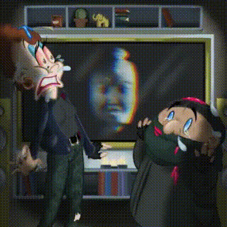

# task
Кевин Калкин, [21.12.2021 12:02]
Так, я исследовал комнату. У тебя нет идей, что делать?

Кевин Калкин, [21.12.2021 13:34]
Идея супер, сейчас погуглю хорошие идеи со скримером

Кевин Калкин, [21.12.2021 13:34]
Давай что-то такое запустим на телевизоре
https://youtu.be/SsH2ObfbeJw

Кевин Калкин, [21.12.2021 13:34]
Ты, кстати, не знаешь, откуда это лицо?

Кевин Калкин, [21.12.2021 13:35]
Ну ладно, выглядит крипово, то что надо 🥴

Кевин Калкин, [21.12.2021 13:35]
План такой. Надо запрогать умный дом так, чтобы:

Кевин Калкин, [21.12.2021 13:35]
1. Сначала выключался свет.
2. Потом внезапно скример на телевизоре.
3. Потом камин загорается и начинает ЖАРИТЬ огнем.
4. Затем скачет свет.

Кевин Калкин, [21.12.2021 13:35]
Что-то вроде этого
https://youtu.be/JUT6VT0GfEE?t=718

Кевин Калкин, [21.12.2021 13:35]
Я тогда прыгну на зиплайн и поеду!

Кевин Калкин, [21.12.2021 13:35]
Так, я придумал 5000 скримеров, осталось понять, в каком порядке их нужно включать.

Кевин Калкин, [21.12.2021 13:35]
Для каждого скримера есть информация, каких скримеров нужно запустить перед ним, чтобы получилось максимально страшно 😱. Я записал ее в отдельный файл. В файле все по порядку: будет 5000 строчек описания, в каждой сначала идет число K — количество скримеров, которые надо запустить перед i-м, после чего еще K чисел через пробел — номера этих скримеров.

Кевин Калкин, [21.12.2021 13:35]
Вот, лови файлы

Кевин Калкин, [21.12.2021 13:35]
[ File : advent_11.sample.pdf ](doc/advent_11.sample.pdf)

Кевин Калкин, [21.12.2021 13:35]
[ File : advent_11.test.txt ](advent_11.test.txt)

Кевин Калкин, [21.12.2021 13:35]
Я хотел 5000 раз запускать такого скримера, который не был запущен раньше, а его номер среди всех доступных скримеров был минимален. Будет гораздо удобнее, если ты построишь последовательность из номеров для такого запуска, чтобы мне не пришлось просчитывать ее самому.

Кевин Калкин, [21.12.2021 13:35]
Чтобы зря не присылать все 5000 чисел, я попрошу у тебя сумму i * a_i в такой последовательности (загляни в пример, чтобы было понятнее!). Дальше я уже как-нибудь восстановлю последовательность!

# answer
Кевин Калкин, [21.12.2021 15:39]
Ставлю!!

Кевин Калкин, [21.12.2021 15:39]
Вот это будет круто! я поехал на зиплайне, открывай им дверь

Кевин Калкин, [21.12.2021 15:39]
[ Voice message : Unknown Track ](doc/audio_2021-12-29_13-50-46.ogg)

Кевин Калкин, [21.12.2021 15:39]

Кевин Калкин, [21.12.2021 15:39]
[ Voice message : Unknown Track ](doc/audio_2021-12-29_13-50-56.ogg)

Кевин Калкин, [21.12.2021 15:39]
Все в порядке, я приехал)

Кевин Калкин, [21.12.2021 15:39]
Бегу по улице!!!

Кевин Калкин, [21.12.2021 15:39]
Блин, я поскользнулся и упал, а в это время загорелся красный светофор! Стою жду((((

Кевин Калкин, [21.12.2021 15:39]
Передо мной огромный мужчина, а бандиты догоняют!

Кевин Калкин, [21.12.2021 15:39]
Да!

Кевин Калкин, [21.12.2021 15:39]

Кевин Калкин, [21.12.2021 15:39]
Ахахахахахахаха

Кевин Калкин, [21.12.2021 15:39]
Так, они бегут дальше, хоть и отстали! Надо куда-то спрятаться

Кевин Калкин, [21.12.2021 15:39]
Все темным темно. Я добежал до дома дяди и тети, напишу тебе оттуда