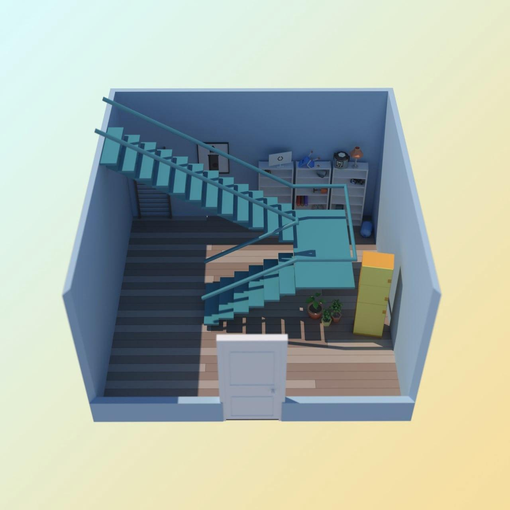

# task
Кевин Калкин, [24.12.2021 12:01]
У меня плохие новости. Дверь подвала сломана, она открывается. Подвал совсем крошечный, я пытаюсь перерыть полки, но тут сплошной хлам, ничего нет

Кевин Калкин, [24.12.2021 12:01]
Нашел скотч, веревки и спички, страшную маску клоуна. Пока не очень складывается, что из этого можно сделать

Кевин Калкин, [24.12.2021 12:01]

Кевин Калкин, [24.12.2021 14:05]
Да, закрыт. Сейчас поищу, нет ли где подсказки

Кевин Калкин, [24.12.2021 14:05]
Нашел!
Вот что написано на задней стенке:
1. Пароль от шкафа состоит из 100 латинских букв.
2. Шкаф разблокирует комбинация символов, которая удовлетворяет 777 ограничениям.
3. Каждое ограничение — это запрещенное значение для какого-то символа.

Нужно найти медианный пароль — это такой пароль, где каждый символ является медианой из доступных символов для этой позиции. Медиана — это минимальный из таких элементов множества, что хотя бы 50% элементов множества не больше медианы.

Кевин Калкин, [24.12.2021 14:05]
Опять ничего не понял, но высылаю тебе файл с запрещенными символами. Там 777 ограничений, число и символ — позиция и запрещенный символ для этой позиции. Присылай мне сразу код, я буду пытаться ввести

Кевин Калкин, [24.12.2021 14:05]
[ File : advent_14.sample.pdf ](doc/advent_14.sample.pdf)

Кевин Калкин, [24.12.2021 14:05]
[ File : advent_14.test.txt ](advent_14.test.txt)

# answer

Кевин Калкин, [24.12.2021 16:44]
Есть! тут хлопушки и феерверки

Кевин Калкин, [24.12.2021 16:44]
Фейерверк возьму с собой, а пока я приклеил хлопушку к двери — отлично рванет, если резко открыть

Кевин Калкин, [24.12.2021 16:44]

Кевин Калкин, [24.12.2021 16:44]
Фух

Кевин Калкин, [24.12.2021 16:45]
Они празднуют 100%. Надеюсь, они хотя бы в городе 😰 пока ответа от маминого знакомого нет

Кевин Калкин, [24.12.2021 16:45]
Я думаю, что я здорово разозлил этих ребят, потому что каждый раз, как дверь запирается, я слышу такие трехэтажные выражения, которых даже старший брат Базз не знает

Кевин Калкин, [24.12.2021 16:45]
Ну, по крайней мере теперь у меня целый арсенал выражений, который я могу ему адресовать

Кевин Калкин, [24.12.2021 16:45]
Я пошел на кухню, поем и передохну. Жди новостей!