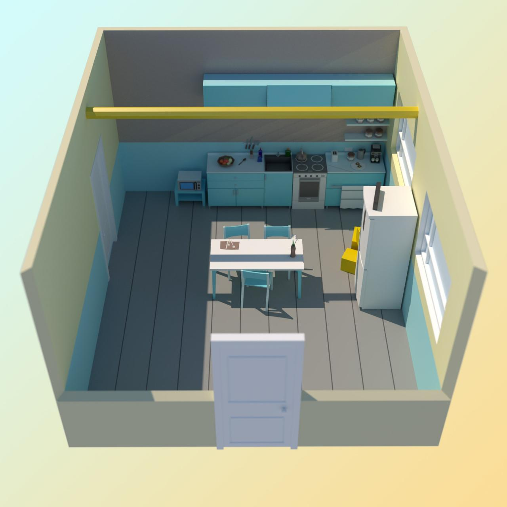

# task
Кевин Калкин, [25.12.2021 12:01]
Так, я съел все запасы сладкого на кухне

Кевин Калкин, [25.12.2021 12:01]
Вот, кстати, схема комнаты. Может, мне стоит включить газ?

Кевин Калкин, [25.12.2021 12:01]

Кевин Калкин, [25.12.2021 13:44]
Ок, под мойкой есть большая бутылка с надписью kerosene

Кевин Калкин, [25.12.2021 13:44]
Смотрю холодильник, за ним куча картонных коробок. О, и робот-пылесос!

Кевин Калкин, [25.12.2021 13:44]
Да тут сотня яиц внутри холодильника!

Кевин Калкин, [25.12.2021 13:44]
У дяди чуть менее продвинутая система, но думаю, еще полчаса у нас есть, пока они подбирают пароль к двери

Кевин Калкин, [25.12.2021 13:44]
Я придумал план.

Кевин Калкин, [25.12.2021 13:44]
Давай повесим коробки с яйцами по всей длине балки. Дно коробок заклеим бумажным скотчем. Затем приклеим кончик к роботу-пылесосу, он поедет и откроет все коробки

Кевин Калкин, [25.12.2021 13:44]
Лови. Я измерил расстояние от двери до двери, робот должен проехать ровно 10,5 метра с максимальной скоростью. Дядя расставил датчики по комнате, они смогут трековать расстояние до пылесоса

Кевин Калкин, [25.12.2021 13:45]
У нас есть 223 датчика в двумерном пространстве. Давай расстоянием между точками (x1, y1) и (x2, y2) назовем |x1 − x2| + |y1 − y2|. Нужно найти точку, в которой суммарное расстояние от нее до всех остальных датчиков одинаково.

Если таких точек несколько, выбирай точку с минимальной суммой x + y. Присылай мне сумму x + y, как посчитаешь.

Кевин Калкин, [25.12.2021 13:45]
Вот файлик с координатами

Кевин Калкин, [25.12.2021 13:45]
[ File : advent_15.sample.pdf ](doc/advent_15.sample.pdf)

Кевин Калкин, [25.12.2021 13:45]
[ File : advent_15.test.txt ](advent_15.test.txt)

# answer

Кевин Калкин, [25.12.2021 17:59]
Есть!

Кевин Калкин, [25.12.2021 17:59]
Говори, когда бежать, и открывай дверь, я помчу со всех ног

Кевин Калкин, [25.12.2021 17:59]

Кевин Калкин, [25.12.2021 17:59]
Скорее блокируй двери!

Кевин Калкин, [25.12.2021 17:59]
Йес, я успел схватить робота, прежде чем дверь захлопнулась!