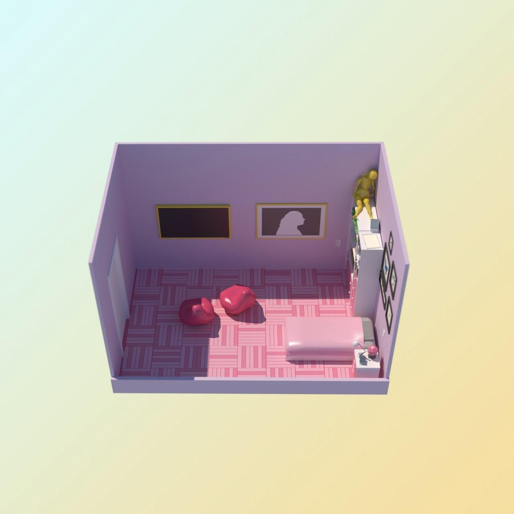

# task

Кевин Калкин, [26.12.2021 12:01]
Последняя комната, надо искать дальше пути отступления

Кевин Калкин, [26.12.2021 12:01]
Похоже на комнату моей двоюродной сестры. Замок тут вряд ли крепкий, но сутки у нас точно есть

Кевин Калкин, [26.12.2021 12:01]

Кевин Калкин, [26.12.2021 12:03]
Шкаф не заперт. Так, тут есть кукла в мой рост, веревочная лестница..

Кевин Калкин, [26.12.2021 12:03]
Подожди, тебе не кажется, что телевизор и картина одного размера??

Кевин Калкин, [26.12.2021 12:03]
Давай я сниму рамку и вставлю в телевизор, а ты придумай, пожалуйста, как включить телевизор. В итоге у нас должно получиться примерно так
https://youtu.be/N0s912lF6Zc

Кевин Калкин, [26.12.2021 12:03]
Телевизор можно представить как прямоугольник в декартовой системе координат. Некоторые внутренние точки прямоугольника заблокированы для проводов, на них находятся крепления.
Надо найти кратчайшую длину провода, которым можно соединить точки А и B. Провод можно прокладывать между точками с целыми координатами и только параллельно одной из осей координат.

Кевин Калкин, [26.12.2021 12:03]
Вот, лови, как выглядит картина

Кевин Калкин, [26.12.2021 12:03]
[ File : advent_16.sample.pdf ](doc/advent_16.sample.pdf)

Кевин Калкин, [26.12.2021 12:03]
[ File : advent_16.test.txt ](advent_16.test.txt)

# answer

Кевин Калкин, [26.12.2021 17:09]
Спасибо, то что надо

Кевин Калкин, [26.12.2021 17:09]
Я вдруг понял, что мы общаемся уже почти две недели, а я до сих пор не знаю твое имя

Кевин Калкин, [26.12.2021 17:09]
Как тебя зовут?

Кевин Калкин, [26.12.2021 17:14]
Мне, конечно, хотелось бы узнать твое настоящее имя 🙂 чтобы я записал тебя в телефоне. К тому же мама говорит не общаться с незнакомыми. Меня, кстати, зовут Кевин Калкин. А тебя?

#name 
Кевин Калкин, [26.12.2021 17:14]
Кайф 🙂

Кевин Калкин, [26.12.2021 17:14]
Я  пока займусь куклой. Напишу, как буду готов