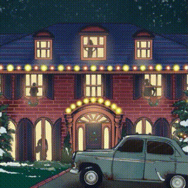

# task
Кевин Калкин, [14.12.2021 13:34]
Слушай, меня в подвале посетила идея

Кевин Калкин, [14.12.2021 13:34]
Я нашел кучу старых манекенов с папиной работы и накидал быстро схему, как их расставить. Мы можем сделать так, чтобы они двигались: взять несколько машинок на пульте управления и прикрепить к ним манекены. Ты можешь заставить их двигаться?

Кевин Калкин, [14.12.2021 13:34]
Мне нужно, чтобы две машинки двигались туда-сюда вдоль окна. Одна машинка будет ехать от левого края окна, доезжать до определенной точки и разворачиваться обратно, а вторая — делать то же самое, но от правого края окна. Важно, чтобы процесс повторялся для каждой машинки независимо.

Можешь помочь рассчитать, через сколько времени после запуска машинки одновременно окажутся у края окна?

Кевин Калкин, [14.12.2021 13:34]
Длина окна 945747, а координата точки, куда доезжает машинка, — 130713

Кевин Калкин, [14.12.2021 13:34]
А вот пример, как такое решается

Кевин Калкин, [14.12.2021 13:34]
[advent_2.sample.pdf](doc/advent_2.sample.pdf)

Кевин Калкин, [14.12.2021 13:34]
Просто скинь число

## answer
Кевин Калкин, [14.12.2021 13:58]
ЕЕЕСТЬ!

Кевин Калкин, [14.12.2021 13:58]

Кевин Калкин, [14.12.2021 13:58]
[ Voice message : Unknown Track ](doc/audio_2021-12-29_13-12-50.ogg)

Кевин Калкин, [14.12.2021 13:59]
Да, они свалили, но уверен, что они вернутся завтра. В подвале две комнаты, из второй идет лестница наверх

Кевин Калкин, [14.12.2021 13:59]
Ту я запер и пока разведаю обстановку. Напишу тебе, как пойму, что есть в комнате и как мы можем дальше держать оборону

Кевин Калкин, [14.12.2021 13:59]
Ладно, не буду тебя отвлекать, ты же, наверное, работаешь

Кевин Калкин, [14.12.2021 13:59]
Ок!