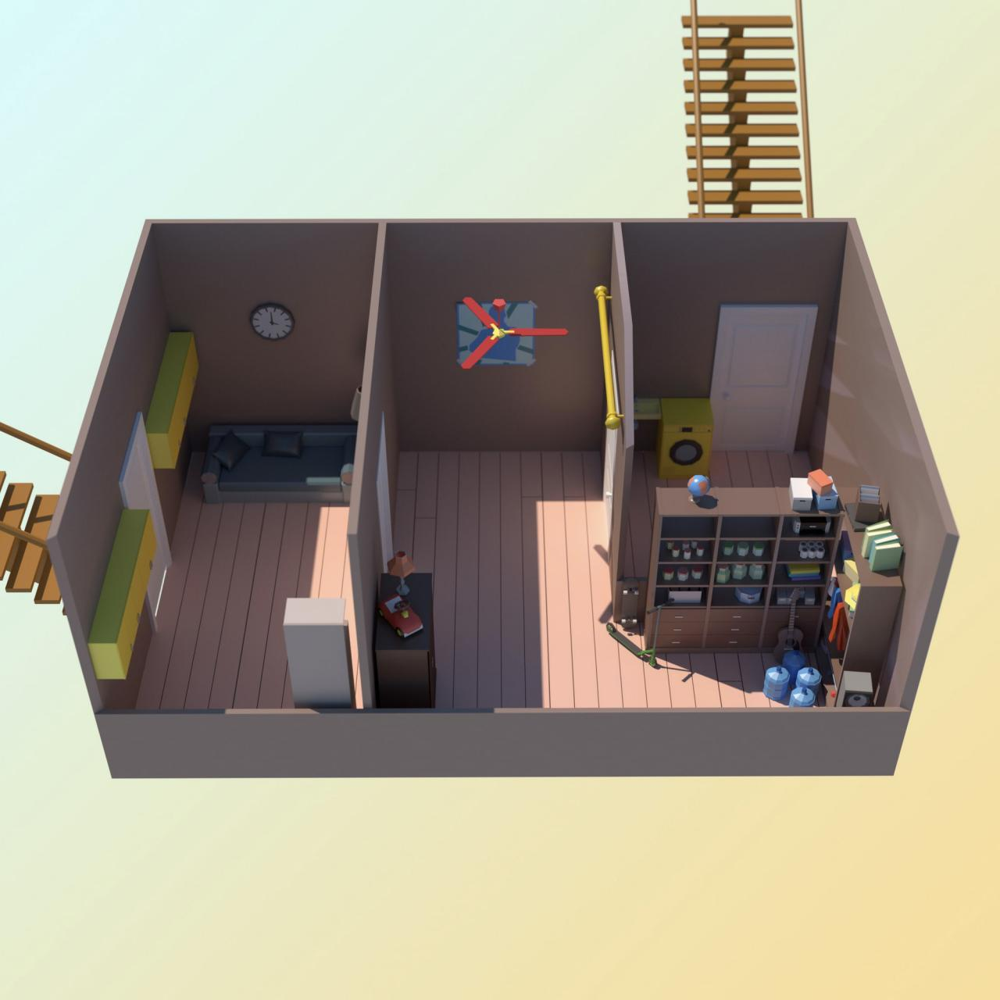

# task
Кевин Калкин, [15.12.2021 12:41]
Привет)

Кевин Калкин, [15.12.2021 12:41]
Забыл сказать. Мой папа повернут на умных устройствах, поэтому их полно дома.
Единственное, он все заблокировал перед отъездом, ты сможешь помочь мне их взломать?

Кевин Калкин, [15.12.2021 12:41]
Папа немного контрол-фрик, у него отдельный пароль на каждое устройство

Кевин Калкин, [15.12.2021 12:41]

Кевин Калкин, [15.12.2021 12:41]
Я уверен, что они пойдут от подвала — входную дверь слишком сложно взломать. Мне кажется, нам надо залить лестницу водой, надо только найти, где взять воду

Кевин Калкин, [15.12.2021 12:42]
Ооо, нет 😅 Мама ненавидит все эти устройства, они с папой всегда об этом спорят. Так что если мы проворачиваем идею с лестницей вместе, проще через папины IoT

Кевин Калкин, [15.12.2021 12:43]
Точно, у раковины стиралка. Надо только надо включить водопровод, вот папина схема

Кевин Калкин, [15.12.2021 12:43]
Смотри, ручка для включения расположена очень высоко, я не дотягиваюсь. Но есть вариант связать из веревочек лассо, я накину его на ручку.

Кевин Калкин, [15.12.2021 12:43]
Ручка находится на высоте 1000000000, а у меня есть 100000 веревочек разной длины. Времени у нас мало, надо получить веревку длиной не меньше чем 1000000000, сделав минимальное количество узлов (то есть использовав минимальное количество веревок).

Кевин Калкин, [15.12.2021 12:43]
Сейчас скину, какой длины у меня есть веревочки.

Кевин Калкин, [15.12.2021 12:43]
[ File : advent_3.sample.pdf ](doc/advent_3.sample.pdf)

Кевин Калкин, [15.12.2021 12:43]
[ File : advent_3.test ](advent_3.test)

# answer
Кевин Калкин, [15.12.2021 13:42]
Йеее! Залил, скоро они будут здесь. Запираю дверь и бегу в следующую комнату!

Кевин Калкин, [15.12.2021 13:49]
[ Voice message : Unknown Track ](doc/audio_2021-12-29_13-28-05.ogg)

Кевин Калкин, [15.12.2021 13:49]
Я побежал в следующую комнату, в этой заблокировал дверь, так что еще где-то 12 часов я в безопасности

Кевин Калкин, [15.12.2021 13:49]
Я же говорил, папа — контрол-фрик. У каждой двери есть SOS-кнопка, отключенная от интернета, она блокирует дверь. Взломать сложно, но можно, тут либо пилить дверь, либо перебирать пароль — в любом случае это занимает около 12 часов

Кевин Калкин, [15.12.2021 13:49]
Папа хвастался маме, когда уговаривал напичакать дом IoT))) мама была сильно против

Кевин Калкин, [15.12.2021 13:50]
В общем-то, нет. Мама скорее ворчит, папа все время шутит и подкалывает ее, мол, она ретроград. Думаю, у них такая игра, она не всерьез ворчит

Кевин Калкин, [15.12.2021 13:50]
Хотел бы я уметь так же легко относиться к ее придиркам, как папа. Вообще, я ему завидую — они с мамой всегда вместе, а я иногда совсем один

Кевин Калкин, [15.12.2021 13:50]
Как сейчас

Кевин Калкин, [15.12.2021 13:50]
Но надеюсь, что это только пока я маленький. Пока ты ребенок, приходится играть по их правилам. А тебе бывает одиноко?

Кевин Калкин, [15.12.2021 13:50]
Почему? Получается, жизнь всегда такая ерунда, а не только в детстве?

Кевин Калкин, [15.12.2021 13:50]
Тоже ответ. Спасибо, Хорошо, что мы сейчас про это поговорили, теперь мне легче

Кевин Калкин, [15.12.2021 13:50]
Каким бы дурацким ни было мое положение, теперь у меня есть друг, который мне помогает 🙂 значит, у нас всех еще есть шанс

Кевин Калкин, [15.12.2021 13:50]
Возвращаясь к вопросу удачи: несмотря на незавидное положение, осаду можно держать долго

Кевин Калкин, [15.12.2021 13:50]
Ладно, я напишу тебе завтра!