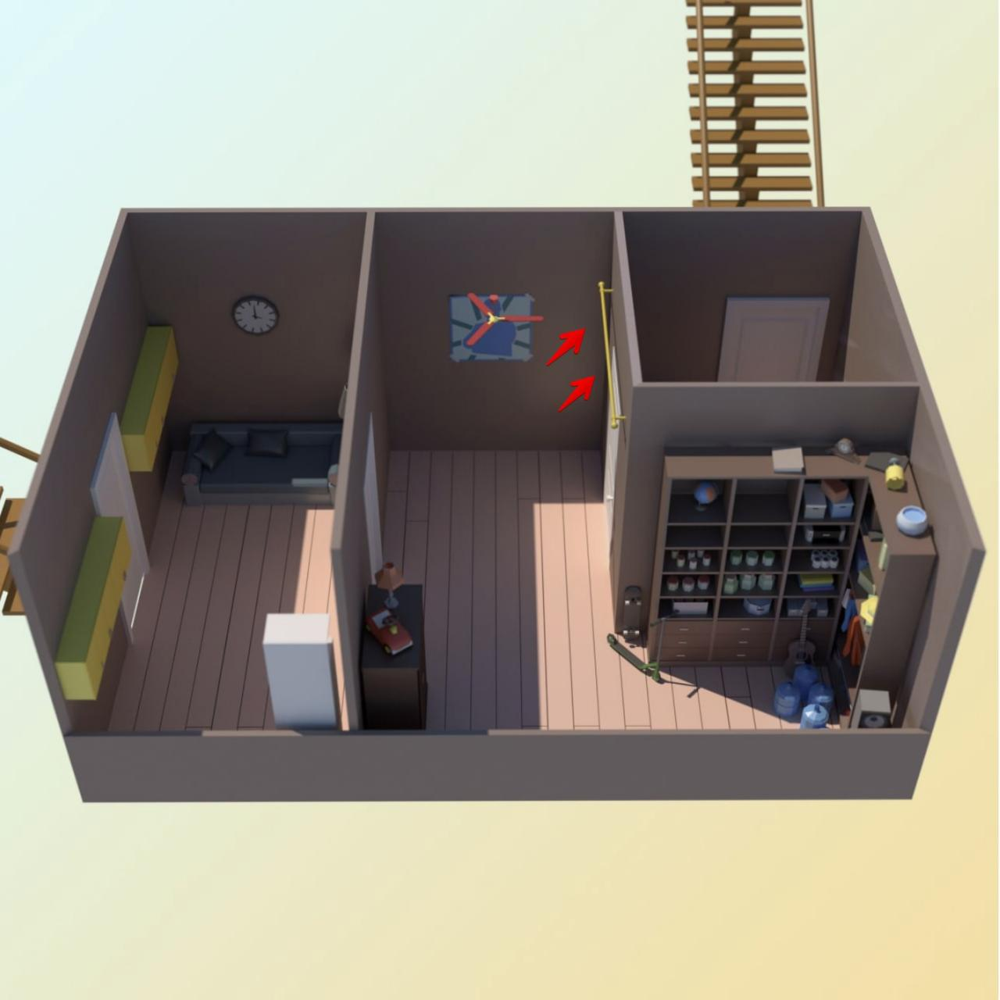

# task

Кевин Калкин, [16.12.2021 12:21]
[ Voice message : Unknown Track ](doc/audio_2021-12-29_13-29-20.ogg)

Кевин Калкин, [16.12.2021 12:41]
Я сейчас тут. Сегодня нам предстоит 2 задачи.

Кевин Калкин, [16.12.2021 12:41]

Кевин Калкин, [16.12.2021 12:41]
Посмотри, вот тут есть балка прямо над входом. Я думаю если расставить на ней банки с краской и привязать к ним веревку, а веревку к вентилятору на потолке, то при включении вентилятора краска польется прямо на них 👺

Кевин Калкин, [16.12.2021 12:41]
Я слышу какой-то шум!!

Кевин Калкин, [16.12.2021 12:41]
Взламывают дверь сюда! Думаю, справятся с дверью минут за 30. Я пока расставлю банки, можешь помочь взломать систему умного дома и сделать так, чтобы при открытии двери сработал вентилятор??

Кевин Калкин, [16.12.2021 12:41]
У вентилятора разные длины лопастей. Всего 212850 лопастей, длины равны l_i. Пароль от вентилятора — количество различных положений, которые вентилятор может принять, поворачиваясь на 360 / 212850 × i градуcов. Два положения считаются одинаковыми, если после перенумеровки последовательность длин лопастей совпадает с исходной.

Кевин Калкин, [16.12.2021 12:41]
Сейчас скину тебе файл: в строке через пробел 212850 чисел — длина каждой лопасти.

Кевин Калкин, [16.12.2021 12:41]
[ File : advent_4.sample.pdf ](doc/advent_4.sample.pdf)

Кевин Калкин, [16.12.2021 12:41]
[ File : advent_4.test.txt ](advent_4.test.txt)

# answer
Кевин Калкин, [16.12.2021 14:13]
Бам, сделано! Спасибо)) пора в следующую комнату

Кевин Калкин, [16.12.2021 14:13]
