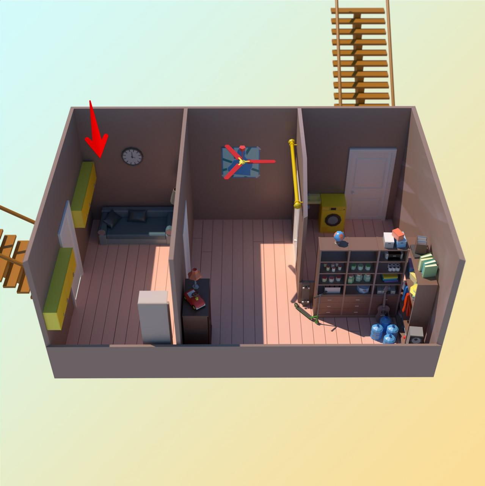

# task
Кевин Калкин, [16.12.2021 14:13]
Кажется, они разозлились! Дергают дверь, сейчас скину план другой комнаты

Кевин Калкин, [16.12.2021 14:13]
Так, я здесь

Кевин Калкин, [16.12.2021 14:13]

Кевин Калкин, [16.12.2021 14:16]
Нет времени! Кажется, дверь открывается, система дала сбой. Придется как-то их задержать.

Понимаю, что это дополнительная задачка для тебя. На сегодня последняя. Сможешь мне помочь, пожалуйста?

Кевин Калкин, [16.12.2021 14:16]
Папа написал код от замка на бумажке рядом со шкафом, но кто-то пролил на запись чай. Некоторые цифры неразборчивые, не могу понять, что там: похоже на несколько цифр сразу. Перебрать все варианты мы не успеем, но есть идея попробовать 5-е по возрастанию значение кода, потому что 5 — это любимое число папы.

Кевин Калкин, [16.12.2021 14:16]
В общем, у нас есть 5 чисел на бумажке. Вот, в файле (если неразборчиво, то пишу что вижу)

Кевин Калкин, [16.12.2021 14:16]
[ File : advent_5.sample.pdf ](doc/advent_5.sample.pdf)

Кевин Калкин, [16.12.2021 14:16]
[ File : advent_5.test.txt ](advent_5.test.txt)

Кевин Калкин, [16.12.2021 14:17]
Напиши 5-е по возрастанию значение кода, думаю, сработает

# answer

Кевин Калкин, [16.12.2021 17:04]
Есть, открылось. Я нашел смолу, ацетатную пленку и клей от комаров. Забегу по лестнице и залью смолой ступеньки, заблокирую дверь

Кевин Калкин, [16.12.2021 17:04]
Фуууух, я на первом этаже. Эта дверь вроде в порядке. Я пошел сделаю сэндвич, напишу тебе потом

Кевин Калкин, [16.12.2021 17:04]
Хорошо)