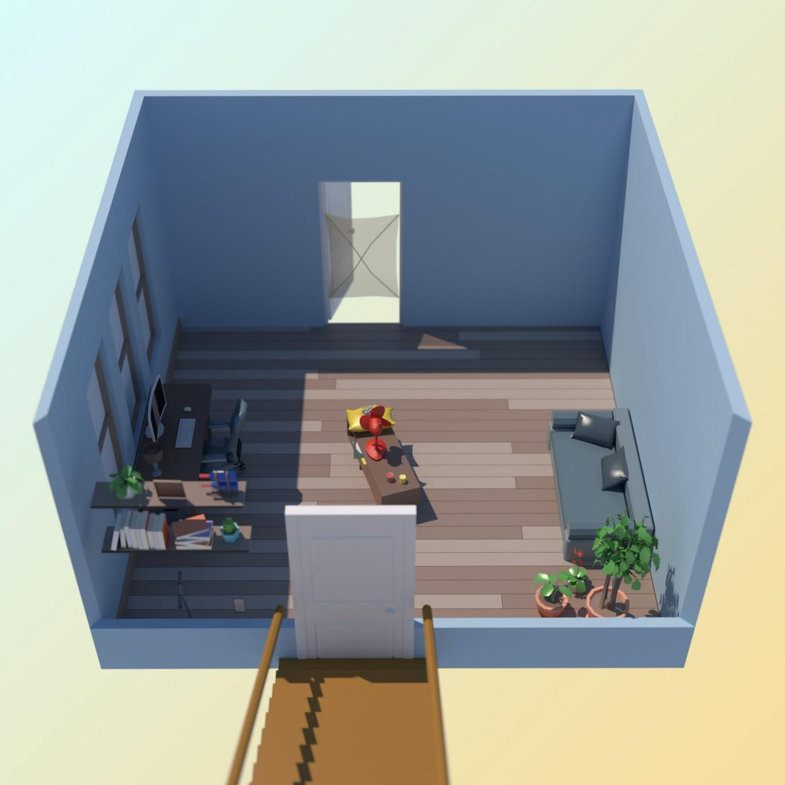
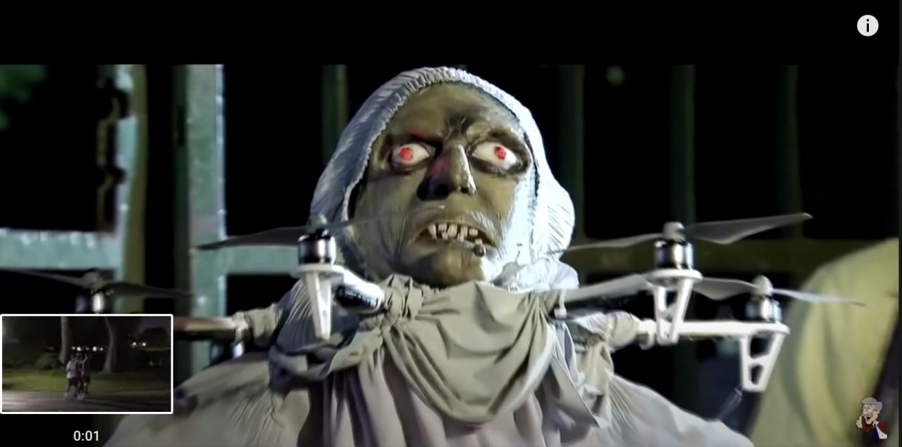
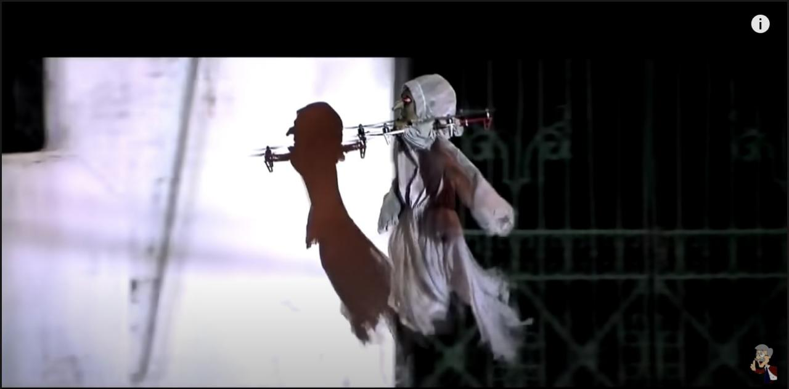
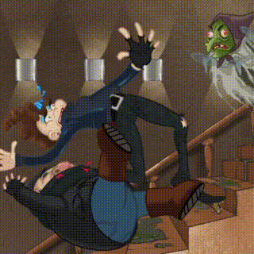
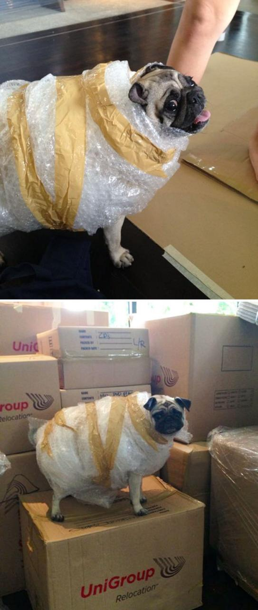

# task
Кевин Калкин, [17.12.2021 12:03]
Йоу, так значит я тут

Кевин Калкин, [17.12.2021 12:03]

Кевин Калкин, [17.12.2021 12:03]
Ай, я на что-то наступил!

Кевин Калкин, [17.12.2021 12:03]
Кажется, это квадрокоптер моего брата, даже пульт управления есть!

Кевин Калкин, [17.12.2021 12:03]
Слушай, у меня есть идея. Я погуглил и нашел на Ютубе вот такое чучело, делается из простыней, маски и коптера

Кевин Калкин, [17.12.2021 12:03]

Кевин Калкин, [17.12.2021 12:03]

Кевин Калкин, [17.12.2021 12:03]
Я пока его построю, а ты помоги разобраться с управлением коптера. У моего брата есть планшет, я запрограммирую, как ты скажешь

Кевин Калкин, [17.12.2021 12:03]
Смотри, я написал план движения коптера символами L, R, D, U (команды ВЛЕВО, ВПРАВО, НАЗАД, ВПЕРЕД)

За одну команду коптер двигается на 10 сантиметров в указанном направлении. Но проблема в том, что я написал слишком длинно. Можно ли «пожать» эту команду, чтобы все было короче, но коптер в итоге переместился туда же?

Сейчас пришлю команду файликом. Можешь среди всех пожатых команд прислать лексикографически минимальную? Это такая, где буквы отсортированы по возрастанию, как в словаре.

Кевин Калкин, [17.12.2021 12:03]
[ File : advent_6.sample.pdf ](doc/advent_6.sample.pdf)

Кевин Калкин, [17.12.2021 12:03]
[ File : advent_6.test.txt ](advent_6.test.txt)

# answer
Кевин Калкин, [17.12.2021 13:19]
Готово! Давай так: ты автоматически открываешь дверь, я запускаю ведьму, потом сразу захлопывай дверь!

Кевин Калкин, [17.12.2021 13:19]

Кевин Калкин, [17.12.2021 13:19]
[ Voice message : Unknown Track ](doc/audio_2021-12-29_13-38-57.ogg)

Кевин Калкин, [17.12.2021 13:19]
Шалость удалась))

Кевин Калкин, [17.12.2021 13:19]
Так, я нашел пуховые подушки, вентилятор и дезодорант брата

Кевин Калкин, [17.12.2021 13:19]
Я нашел целый ящик этих вонючек

Кевин Калкин, [17.12.2021 13:19]
А у тебя есть братья или сестры?

Кевин Калкин, [17.12.2021 13:19]
А ты старший или младший ребенок?

Кевин Калкин, [17.12.2021 13:19]
И вы теперь общаетесь, когда выросли?

Кевин Калкин, [17.12.2021 13:19]
Мне кажется, что когда я вырасту, первым делом куплю билет в Австралию и уеду от них всех куда подальше

Кевин Калкин, [17.12.2021 13:20]
И что. Сейчас Базз постоянно меня достает

Кевин Калкин, [17.12.2021 13:20]
Для меня нет ничего хуже запаха его дезодоранта: это запах надвигающихся проблем

Кевин Калкин, [17.12.2021 13:20]
Когда мы сюда переезжали, я попросил его помочь мне упаковать мои вещи, оставил ненадолго, и вот что он сделал с моей собакой

Кевин Калкин, [17.12.2021 13:20]

Кевин Калкин, [17.12.2021 13:20]
и не говори

Кевин Калкин, [17.12.2021 13:20]
Хотел бы я быть единственным ребенком в семье. Я загадываю это на каждый Новый год, но теперь, когда я один, начинаю думать, что желания иногда сбываются самым извращенным способом

Кевин Калкин, [17.12.2021 13:20]
Да уж