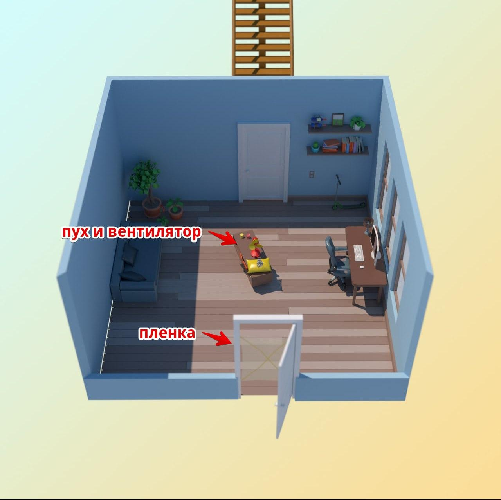

# task
Кевин Калкин, [18.12.2021 12:03]
Привет)

Кевин Калкин, [18.12.2021 12:03]
Я придумал, как использовать пуховые подушки, вентилятор и клей из подвала

Кевин Калкин, [18.12.2021 12:03]
Короче, план такой (на сегодня у нас 2 задачи):

Кевин Калкин, [18.12.2021 12:03]
1. На дверь наклеим мамину ацетатную пленку на уровне лица, намажем ее клеем.

Кевин Калкин, [18.12.2021 12:03]
2. Когда у бандитов станет липкое лицо, включим вентилятор и отправим на них целую волну пуха. Пух я положу перед вентилятором на высоте лица. Можешь помочь с клеем, пожалуйста?

Кевин Калкин, [18.12.2021 12:03]

Кевин Калкин, [18.12.2021 12:04]
Тут на самом деле целый мешок банок с клеем, надо разобраться, какой будет самым липким 😈

Кевин Калкин, [18.12.2021 12:04]
Они все пронумерованы, просто скажи мне номер нужной баночки. Можешь вычислить? Либо можно расшифровать записи отца из шкафа в подвале

Кевин Калкин, [18.12.2021 12:04]
Смотри, тут на каждой баночке с клеем написаны номера нескольких баночек, которые будут более липкими, чем имеющаяся. Надо найти баночку с самым липким содержимым. Можешь посчитать сумму номеров баночек, которые надо проверить?

Кевин Калкин, [18.12.2021 12:04]
Тут всего 50000 баночек, вот файл со всеми данными. В строках после первой (таких строк будет ровно 50000) будет написано сначала количество банок в строке (обозначим за m), а затем m чисел через пробел. Каждое из чисел k в i-й строке означает, что банка с номером i менее липкая, чем банка с номером k.

Кевин Калкин, [18.12.2021 12:04]
[ File : advent_7.sample.pdf ](doc/advent_7.sample.pdf)

Кевин Калкин, [18.12.2021 12:04]
[ File : advent_7.test.txt ](advent_7.test.txt)

# answer
Кевин Калкин, [18.12.2021 15:27]
Супер, спасибо! Наклеил.