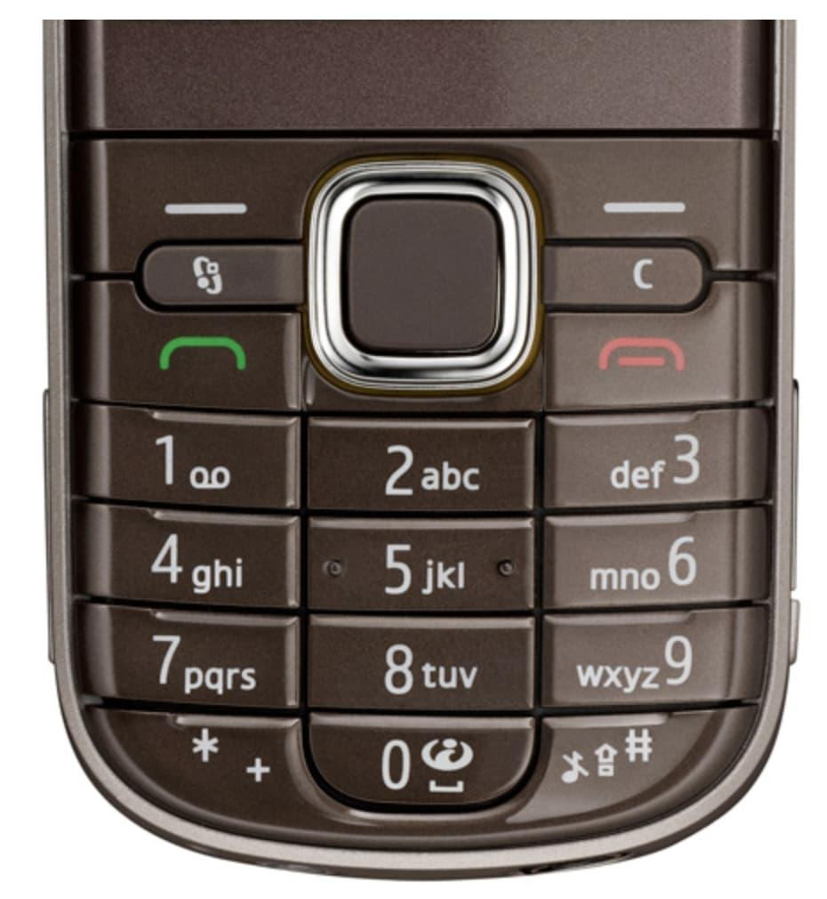
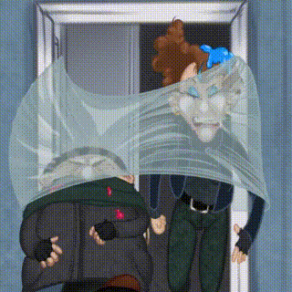
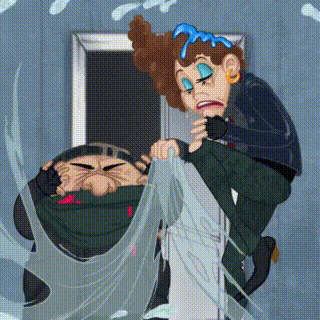

# task
Кевин Калкин, [18.12.2021 15:27]
Осталось включить вентилятор через специальный пульт. Он довольно непростой: буквы набираются с помощью многократного нажатия на одну и ту же кнопку. Вот так выглядит пульт:

Кевин Калкин, [18.12.2021 15:27]

Кевин Калкин, [18.12.2021 15:27]
Я нашел на обратной стороне бумажку: там последовательность кнопок-нажатий, но не сказано, в какой момент нужно завершать каждый символ.

Если ты не помнишь, как работают кнопочные пульты: при многократном нажатии на кнопку символ переключается на следующий. 2 -> A, 22 -> B, 222 -> C. Символа, соответствующего нажатиям 2222, нет, это уже будет несколько символов подряд (например 22 + 22 -> BB, или 2 + 222 -> AC).

Кевин Калкин, [18.12.2021 15:27]
Думаю, что последовательность 222 может означать как строку AAA, так и строку C. Я точно знаю, что код — это самая короткая строка, которая подходит под последовательность нажатий, а среди самых коротких — самая лексикографически минимальная (например, строка AC лексикографически меньше строки CA, потому что в словаре она встретится раньше).

Кевин Калкин, [18.12.2021 15:27]
Можешь посчитать мне? Я сейчас скину последовательность нажатий.

Кевин Калкин, [18.12.2021 15:27]
[ File : advent_8.sample.pdf ](doc/advent_8.sample.pdf)

Кевин Калкин, [18.12.2021 15:27]
[ File : advent_8.test.txt ](advent_8.test.txt)

# wrong answer
Кевин Калкин, [18.12.2021 17:12]
Вентилятор пока молчит. Может, неправильно разгадано?

# answer
Кевин Калкин, [18.12.2021 18:55]
Фух, спасибо 😇 вроде вентилятор работает, я разрезал подушки и наложил кучу пуха.

Кевин Калкин, [18.12.2021 18:55]

Кевин Калкин, [18.12.2021 18:55]

Кевин Калкин, [18.12.2021 18:55]
Ииииии, шалость снова удалась!

Кевин Калкин, [18.12.2021 18:55]
Кевин и его партнер нокаутируют бандитов с одного удара! Бам! Бум! Зрители на трибунах рыдают от восторга

Кевин Калкин, [18.12.2021 18:55]
😈😈😈

Кевин Калкин, [18.12.2021 18:55]
До завтра! Напишу тебе, когда у меня снова появится план)